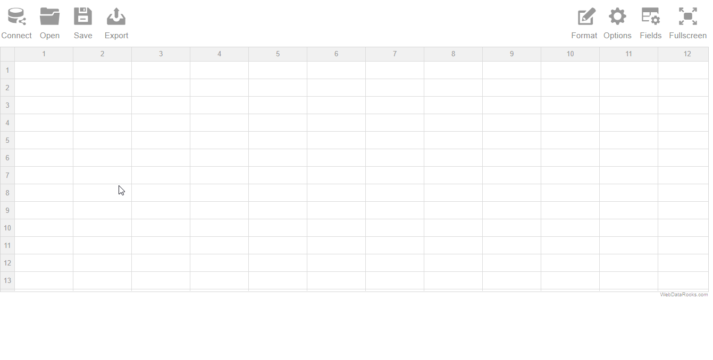
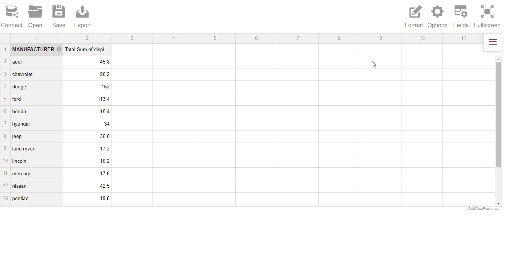
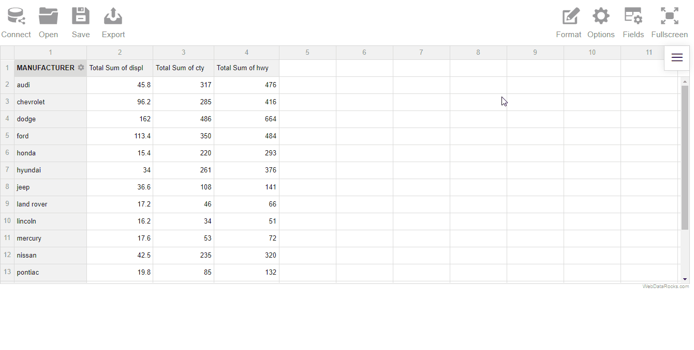
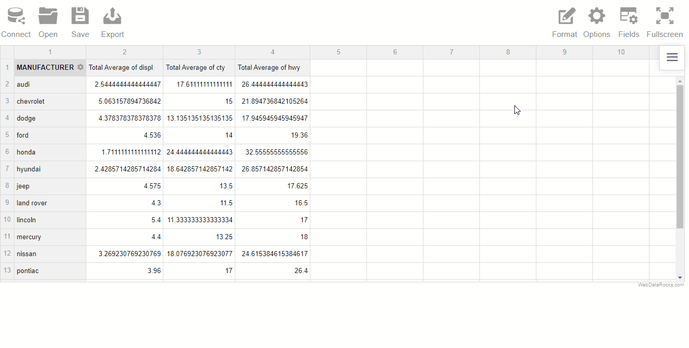
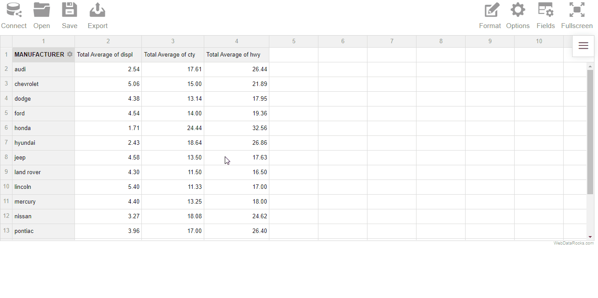
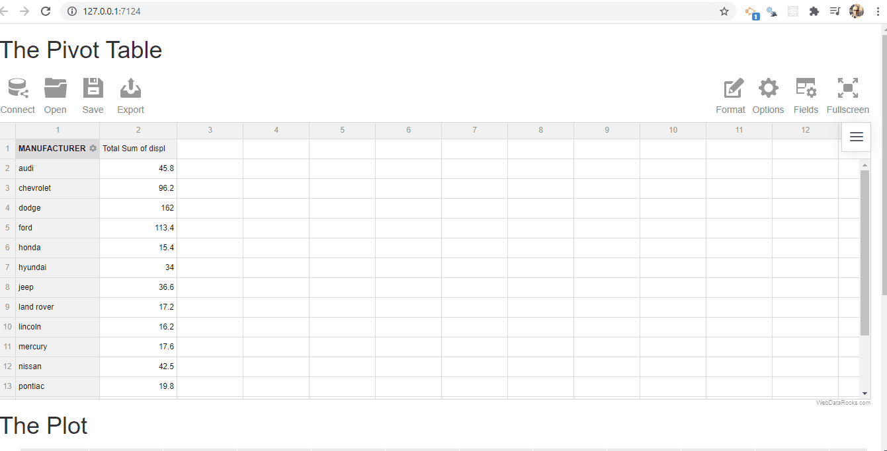

<!-- README.md is generated from README.Rmd. Please edit that file -->

# pivta

`pivta` is an R wrapper of the
[WebDataRocks](https://www.webdatarocks.com/) JavaScript library. The
package allows you to implement an interactive pivot table (among other
data analysis features) throughout an HTML Widget.

The library supports CSV and JSON data. **Note that this is a free
version of the WebDataRocks library, as such the data file uploaded
should not exceed 1MB**. Nonetheless, that’s fair for most modest data
sets

You can install the development version of `pivta` from Github using:

``` r

# install.packages("remotes")

remotes::install_github("feddelegrand7/pivta")
```

# How to use pivta

Just run `pivta()` and start playing \! The function has three main
arguments:

  - *source*: Optional. Allows you to specify ex-ante the location of
    the csv/json data frame, by providing a URL.
  - *sep*: The CSV data frame separator. Defaults to comma (“,”). Will
    be ignored if data is JSON.
  - *report*: Optional. Allows you to specify ex-ante the location of
    your JSON report file (see below).

In Shiny, you’ll have to use the `pivtaOutput()` and `renderPivta()`
functions.

# Examples

<hr>

Let’s work with the
[CSV](https://gist.githubusercontent.com/feddelegrand7/b366864aabf9653361f461cbf972d97c/raw/a62c4672f2f5824b2634a66c948e6258d7c65323/mpg.csv)
file of the [mpg](https://ggplot2.tidyverse.org/reference/mpg.html) data
frame. You can upload the file locally or specify its URL using the
**source** argument.

When loading a CSV file, the pivot table will by default aggregate the
sum of the values of the first numeric column according to the first
character column that it recognizes.

``` r
library(pivta)

pivta()
```



We can make some cool analysis:



You can easily change the aggregation measure. Here let’s take a look at
the Average:



Too many numbers after the decimal ? no worry, it’s possible and easy to
format the results:



You can export your results into different format :



The results can also be saved into a JSON file called **report**. If you
want to retrieve the results the next time that you open your Shiny app
you can either upload it locally or store it remotely and provide a URL
that points to the report (within the **report** argument of the
`pivta()` function).

Below an example of the usage of `pivta()` on Shiny:

``` r
library(shiny)
library(pivta)
library(ggplot2)

ui <- fluidPage(

    h1("The Pivot Table"), 
    
    pivtaOutput(outputId = "pivot_table"),
    
    h1("The Plot"),
    
    plotOutput(outputId = "plt1")

)

server <- function(input, output) {
  
  
  
output$pivot_table <- renderPivta({
  
  
  pivta(dsource =  "https://gist.githubusercontent.com/feddelegrand7/b366864aabf9653361f461cbf972d97c/raw/a62c4672f2f5824b2634a66c948e6258d7c65323/mpg.csv")
  
  
})  
  
output$plt1 <- renderPlot({
  
  
  ggplot(mpg, aes(cty, hwy)) + 
    geom_point(col = "#324C63")
  
})
  
}

shinyApp(ui = ui, server = server)
```



Finally, feel free to try the other features provided by the
WebDataRocks JS library. You can read the complete documentation
[here](https://www.webdatarocks.com/doc/)

## Code of Conduct

Please note that the pivta project is released with a [Contributor Code
of
Conduct](https://contributor-covenant.org/version/2/0/CODE_OF_CONDUCT.html).
By contributing to this project, you agree to abide by its terms.
